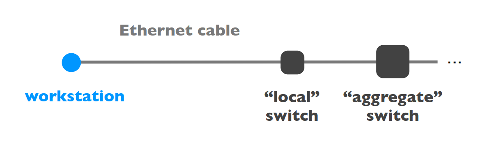

# Overview

- [Overview](#overview)
  - [What is a network made of?](#what-is-a-network-made-of)
    - [Access Technologies](#access-technologies)
  - [How is the network shared?](#how-is-the-network-shared)
  - [How does communication happen ?](#how-does-communication-happen-)
    - [The end-end principle](#the-end-end-principle)
    - [Fate-sharing Principle](#fate-sharing-principle)
  - [How do we characterize network?](#how-do-we-characterize-network)
    - [Sources of network delays](#sources-of-network-delays)
    - [Why does delay matter?](#why-does-delay-matter)
    - [Packet Losses - What are Internet delays like?](#packet-losses---what-are-internet-delays-like)
    - [Throughput](#throughput)

## What is a network made of?
Networks are composed of three basic components :
- **End-systems** : They send and receive Data, such as smartphones, a server, a car navigator etc. (Blue in figure)
- **Switches & routers** : They forward data to the destination e.g. your home router from UPC, Yallo or whater provider (Grey in figure)
- **Links** : They interconnect end-systems and switches and routers. (Red in figure)

    

Conceptually, the last mile of the internet aka your connection from your home PC to a switch look like this :

    

### Access Technologies
where the `DSL : Digital Subscriber Line` brings high bandwith to households over phone lines.  A DSL is composed of 3 channels : 
1. **downstream data** channel  ( tens to few hundrer Maps)
2. **upstream data** channel    ( few Mbps to few tens Mbps)
3. **2-way phone** channel 

Why is there such an asymmetry between the downstream and upstream data channel? Looking back at our "last mile of the interen". Your PC is connected to a *cable modem* which is further connected to a *CMTS* (Cable Modem Termination System) and finally to the *switch*. As you know the cable that is used to connnect the world is made out of fiber.

> Many households share the same access to the *CMTS*, which is why you'll most likely never will get the promised full-speed 10Gbps or whatever the provider promises you.

With respect to DSL and cable providers, **enterprise access** network is much simpler. We can simplify it like this : 

    

> Ethernet is the most widely used *Local Are Network technology*. It consist of twisted pair copper and can deliver up to multiple tens, hundreds Gbps.

Obviously there are many more promising and growing access technologies such as, Cellular (5G). Satellite (Elon's Starlink), Fibers etc.

## How is the network shared?
The benefit of sharing is that a probider can split up its' internet resource to multiple users. As an example : Let's say Swissscom has a 100Mbps connection, they can naively support 20 users by "giving" each user a 5Mbps. Since Users are active during different times in day it is acceptable to have an **oversubscription** of factor **>100x**.

There are two ways on how to share limited network resources :
1. **Reservations** : reserve the bandwith you need in advance
2. **On-demand** : send data when you need it

To observe the difference and when to use what type we take the **Peak** $P$ and **Average** $A$ rate of a flow into consideration.

- Reservations must reserve $P$ but have a level of utilization of $A/P$. e.g. P =100Mbps, A=10Mbps then the level of utilization is 10%
- On-demand can usually achieve higher level of utilization, although it is dependant on degree of sharing and burstiness of flows. 

> - **Large Peak/Average** $\implies$ On-demand e.g. web
> - **Small Peak/Average** $\implies$ Circuits aka Reservations e.g. voice calling

It makes sense that we use reservations if $P/A$ is small, for example voice traffic has a ratio of 3 or so. Reservations *wastes capacity* when $P/A$ is big. Data applications for example are bursty, ratios over 100 are common amongst them.

Intuitively you can say that you always want a steady connection for your voice call whereas a webpage that isn't immediately available isn't all too grave.

## How does communication happen ?
There are a total of five layers :
1. Physical
2. Link
3. Networkk
4. Transport
5. Application

The interfaces between layers should be durable 
- **Applications** built on
- **Reliable (or unreliable) Transport** built on
- **Best-effort global packet delivery** built on
- **Best-effort local packet delivery** built on
- **Physical transfer of bits**

### The end-end principle
We look at reliable transfer at cost of packet losses. for example "a voice call wants speedy delivery, even if it's lossy.." 

If we want to reliably transfer a file from host $A$ to $B$ there are two possible solutions

    

1. Check **Reliability at every step** (involving network layer). Problems such as Bugs, failures are common.
2. Allow **unreliable steps** (network layer is best-effort). $B$ checks correctness. On failure $B$ tells $A$ to retry. This solution depends only on what end-points themselves control.

Question: should we ever implement reliability in the network? Tp answe that question.. Implementing reliability in the network has the following effects : 
- it does not reduce end-host complexity
- it does increase network complexity
- it often imposes overhead for apps that don't need it
- but it can enhance perfomance in some cases

### Fate-sharing Principle

> When storing state in a distributed system, co-locate it with entities that rely on that state. State is lost only if those entities fail; then it doesn't matter. Example would be network connection state at end hosts.

Let's look at an example between two WoW Gamers who want to chat with each other :

    

If we were to create a fictional dialogues in the POV of BOB of the components we'd get sth like :

1. *Switch* : I know the next switch to send this to 
            : Sending to the next switch
2. *Router* : I know the next router to send this to 
            : This frame contains IP packkets
3. *travelling through network, reaching alice's system*
4. *WOW to OS* : where is Alice?
    *OS*       : Alice is at this address $X$ - `wowserver.alice.com - 123.67.191.21` 
    DNS - domain name service : from names to IP addresses
5. *WoW to OS* : OK, send $X$ this message
   $\quad$ Sockets - API between applications and transport
6. *OS* : OK, sending Message
   $\quad$ TCP (reliable) or UDP (unreliable) transport implementation

## How do we characterize network?
A `network connection` is characterized by its :
- **delay** (or latency) - "How long does it take for a packet to reach the destination ?
- **loss rate** - What fraction of packets sent to destination are dropped?
- **throughput** - At what ratae is the destination receiving data from the source?
  
### Sources of network delays
Each packet suffers from several types of delays at each node along the path :

    

Overall, the main culprits for the overall delay are the transmission, propagation and queuing delays. The processing delays tends to be tiny.

    

>The **transmission delay** is the amount of time required to push all of the bits onto the link

$$
\text{Transmission Delay} = \frac{\text{packet size}}{\text{link bandwith}} = \frac{[\# bits]}{[\# bits/sec]} \hspace{0.75cm} \text{exp: } \frac{1000 bits}{100 Mbps} = 10 \mu sec
$$

>The **propagation delay** is the amount of time required for a bit to travel to the end of the lin

$$
\text{Propagation delay} = \frac{\text{link length}}{\text{propagation speed}} = \frac{[m]}{[m/sec]} \hspace{0.75cm} \text{exp: } \frac{30'000 m}{2.10^8 m/sec} = 150 \mu sec
$$

Different transmission characteristics imply different tradeoffs in terms of which delay dominates :

    

>The **queuing delay** is the amount of time a packet  waits (in a buffer) to be transmitted on a link. Queuing delay depends on the **traffic pattern**
- Queuing delay is the hardest to evaluate as it varies from packet to packet
- Queues absorb transient bursts but introduce queueing delays

The time a packet has to wait in a buffer before being processed or sent depends on the **traffic pattern** :
- arrival rate at the queue
- transmission rate of the outgoing link
- traffic business
  
We can define some variabale such as :

    

When the **traffic intensity is >1**, the queue will increase without bound, and so does the queuing delay
When the **traffic intensity is <=1**,  queueing delay depends on the burst size

### Why does delay matter?
Just slightly delays such as +100ms can lead to a -1% revenue for Amazon. In video games one will obviously notice the difference between 10ms and 110ms. Phenomenon such as motion sickness by using Virtual Reality or just gaming are mostly caused by the delay of the motion to what the person sees. 

### Packet Losses - What are Internet delays like?
You can check your ping to google servers by typing `ping google.ch` into your terminal. 

As queues are used to somehow control the flow in the network it has to be noted that in practice, queues are not infinite. There is an upper bound on queuing delay. For a packet Size $L$ and transmission rate $R$ the upper bound is $\frac{N \cdot L}{R}$. If the queue is persistently overloaded it will eventually **drop packets** i.e. packet loss.

Packet Loss does not always matter for example losing a negliible part of conversation.

### Throughput
The throughput is the rate at which a host receives data 
$$
\text{Average Throughput} = \frac{\text{data size}}{\text{transfer time}} = \frac{[\#bits]}{[sec]} \hspace{0.75cm}
$$

To compute throughput, one has to consider the bottleneck link and the intervening traffic

    

Why does throughput matter? Some Applications need little bandwith e.g. gaming needs few kbps, Some need a lot more e.g. HD Streaming needs 5+mbps.