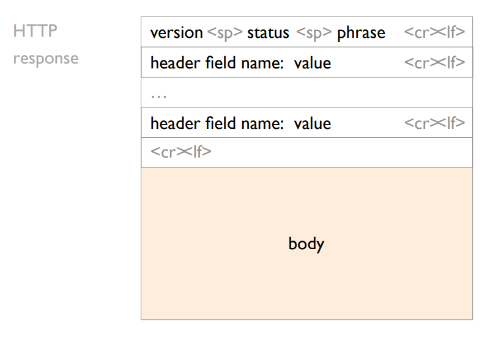

# Applications - DNS, WEB, Video

## DNS - Domain Name Service

The internet has one **global system** for 
- _Addressing_ hosts by design : `IP`
- _naming_ hosts by accident, an afterthought : `Domain Names`

A great analogy : Let phone numbers be IP addresses then the contact you saved it under are the domain names.

### IP and Domain Names

Using Internet Service can be divided into four logical steps :
1. A person has namae of entity aka she wants to access : `www.ethz.ch`
2. She invokes an application to perform the task : `Chrome`
3. The applicaiton invokes DNS to resolve the name into an IP address : `129.132.19.216`
4. The application invokes transport protocol to establish an app-to-app connection 

The DNS system is a **distributed database** which enables resolving a name to an IP address. In practice :
-  names can be mapped to more than one IP. e.g. for a service that is widely used, you can't possibly have only one ip. **Load-Balancing**
-  IP's can be mapped by more than one domain name. e.g. **reusing your machine** if your servive is small and want to reuse it

The question that arises is : *How does one resolve a name into an IP?*

Initially, some decades ago we had a file called `hosts.txt` that provided all name to address mappings. But there are several problems as one might already think : 
- **scalabaility** in term of **query load & speed**
- **management**
- **consistency** - just imagine trying to have millions of devices be up-to-date with hosts.txt
- **availbility**

There are some rules of thumbs to follow : 
1. When you need **more flexiblity** you add **a layer of indirection** `gethostbyname()`
2. When you need **more scalibility**, you add **a hierachical structure**

### DNS Hierarchies
To scale, DNS uses **three** intertwined hierarchies :
1. `naming structure` : addresses are hierarchical
2. `management` : hierarchy of authority over names
3. `infrastructure` : hierarchy of DNS servers

---

***Naming Structure***
Top Level Domain (**TLD**) sit at the top e.g. all the under the root ones in the following figure. We can look at Domains as subtrees : 

<p align = "center">
    
</p>

A name. e.g. `inf.ethz.ch` represents a leaf-to-root patah in the hierarchy : 

<p align = "center" >
    
</p>

---

***Management*** : The DNS system is hierarchically administered
- `root` is managed by IANA
- `ch.` is managed by *The Swiss Education & Research Network*
- `ethz.` is managed by *ETH Zürich Informatikdienste ICT-Networks*

There are a total of 13 root servers that serve as root and are managed professionally. `TLDs` server are also managed professionally by mostly private or non-profit-organisations

<p align = "center" >
    
</p>

The bottom (and bulk) of the hierarchy is managed by Interenet Service Providers or locally e.g. `ehtz`.

---

Each root server knows the address of all TLD servers. In the following example `a.root-servers.ne ch.` knows all the addresses of all children.

```powershell
$ dig @a.root-servers.net ch.
(server) (name)
ch.         172800 IN    NS  a.nic.ch.
ch.         172800 IN    NS  b.nic.ch.
ch.         172800 IN    NS  c.nic.ch.
ch.         172800 IN    NS  d.nic.ch.
ch.         172800 IN    NS  e.nic.ch.
ch.         172800 IN    NS  f.nic.ch.
ch.         172800 IN    NS  h.nic.ch.
```

Any `.ch` DNS server knows the addresses of all sub-domains. e.g. `ch` knows the addresses of `ethz` or `nzz`

---

**Glue Records**
Glue records are DNS records created at the domain’s registrar. The record provides a complete answer when the TLD nameserver returns a reference for an authoritative nameserver for a domain. For example, the domain name “example.net” has nameservers “ns1.example.net” “ns2.example.net”. To resolve the domain name, the DNS would query in order: root, TLD nameserver, and authoritative nameserver. However, by having the authoritative nameservers inside the domain itself, these nameservers cannot be found without outside assistance. This is called a ‘circular reference’. Creating a glue record, an A record served by the TLD nameserver, avoids circular references and allows for both DNS name resolution and listing the nameservers inside the domain itself

<p align = "center" >
    
</p>

More detail will be discussed in further lectures.

---

To ensure **availability**, each domain must have at least a primary and secondary DNS server. (In case one server is down). It needs to have the following properties :
- Ensure name service availability as long as one of the servers is up i.e. accessible under the same Domain name
- DNS queries can be load-balanced across the replicas i.e. split their work
- On Timeout, clients use alternate servers : exponential backoff when trying the same server i.e. when one server isn't working 

--- 

### DNS Queries and Components
Let's look at a specific example :  You've founded `next-startup.ch` and want to host it yourself, how do you insert it into the DNS?

1. You register `next-startup.ch` at a **registrar** $X$ e.g. Swisscom or GoDaddy 
2. Provide $X$ with the name IP of your DNS servers e.g. `[ns1.next-startup.ch, 129.132.19.253]` 
3. You set-up a DNS server `@129.132.19.352` define A records for *www*, MX records for *next-startup.ch*

Here is an overview of what Record hosts what value : 
<p align = "center" >
    
</p>

--- 

Using DNS relies on two components : 
<p align = "center" >
    
</p>

- DNS queries and replies using UDP (port 53). It's reliabaility is implemented by repeating requests
- A DNS server stores *Resource Records* composed of `(name, value, type, TTL)`.
- DNS resolution can either be recursive or iterative

---

Let's further look at those two different types of queries.

**Recursive Query**
When performing a *recusive* query, the client offloads the task of resolving to the server. Basically pushing task to the server and waiting for an answer.
<p align = "center" >
    
</p>

**Iterative Query**
When performing a *iterative* query, the server only returns the address of the next server to query. 
<p align = "center" >
    
</p>

We know that we can reduce loading times in a Computer when we cache some data and access it again. The same can be said for the resolution times. DNS also relies on caching.
- DNS servers caache responses to former queries and your cliend and the applications
- Authoritative servers associate a lifetime to each record : **Time-To-Live (TTL)**
- DNS records can only be cached for TTL seconds after which they must be cleared

As top-level servers rarely change & popular websites are visited often, caching is very **effective**. 
- Top 10% of names account for 70% of lookups
- 9% of lookups are unique - i.e. **Limit chace hit ratio to 91%** 
- Practical cache hit rates **~75%**

---

Some more facts about DNS :
- is often used for blocking/censoring
- is often used for monitroing/tracking
- is often behind security breachees 

Additional readings for DNS : 
- 1.4 Delay, Loss and throughput in packet switched networks
- 1.7 DNS - The internet's directory service

## The WEB 

### Components
The World Wide Web is made of three key components

<p align = "center">
    
</p>

We will focus on its implementation

### URL - name content
A `Uniform Resource Locator` (URL) refers to an Internet resource where
<p align = "center">
    protocol://hostname[:port]/directory_path/resource
</p> 

- protocol : HTTP(S), FTP, SMTP
- hostname : DNS NAME, IP address
- :port : default to protocol's standard e.g. HTTP:80, HTTPS:443
- directory_path/resource : identify the resource on the destination

### HTTP (Hypertext Transfer Protocol) - transport content
`HTTP` is a rather simple. It's a synchronous request-response protocol
- HTTP is layered over a bidirectional byte stream. currently TCP, HTTP/3 only QUIC
- HTTP is text-based (ASCII) - human readable, easy to reason about
- HTTP is stateless - it maintains no info about past client requests

### HTTP - Protocol
HTTP clients make requests to servers
<p align = "center">
    
</p>

We look at the first line : 
<p align = "center">
    
</p>

The following **request headers** are of variable lengths but still human readable. Its uses consist of :
- Authorization Info
- Acceptable document types/encoding
- From (user email)
- If-Modified-Since
- Referrer (causes of the request)
- User Agent (client software)

HTTP servers then answer clients' request
<p align = "center">
    
</p>

Again, the first line :
<p align = "center">
    
</p>

Like request headers, **response headers** are of variable lengths and human-readable. It's uses consist of :
- Location (for redirection)
- Allow (list of methods supported)
- Content encoding (e.g., gzip)
- Content-Length
- Content-Type
- Expires (caching)
- Last-Modified (caching

---

HTTP is a stateless protocol, meaning each request is treated independently. 

Advantages are :
- server-side scalability
- failure handling is trivial
  
Disadvantages  are : 
- some applications need state e.g. shopping cart, user profiles, tracking etc.

HTTP makes the client maintain the state since it's a stateless protocol. This is what the so-called **cookies** are for.
- Client stores small state (on behalf of the server X)
- Client sends state in all future requests to X
- can provide authentication

### HTTP Performance

#### Dependencies
Let's take a look at a simple page : 
<p align = "center">
    
</p>
We can see that there are 3 dependencies in the body block. The browser has to be conservative, therefore introduces blocking, unless it is clear that two resources are independent.

#### Complexity

Today, the average webpage size is 2.3 MB as much as the original DOOM game. Needless ot say the complexitiy may even increase more in the near future.

#### Dependency Graph

Consider the example from before. We can draw a dependency graph from it. Note that the lenght of the bars is no longer meaningful
<p align = "center">
    
</p>

Now to be able to somewhat improve that delay we have to find the critical path of that graph.
1. First, sort the nodes using a topological sort 
2. Process tasks in reverse-sort order 
3. Each task’s finish time is max over tasks it depends on

<p align = "center">
    
</p>

- Nodes are indiviudal tasks
- Edges indicate a "must happen before" relationship
- Edges are annotated with costs i.e. the time it takes for the task

Speeding up any task on the critical path will 
- speed up the end-to-end process or / and
- expose a different critical path

### Speeding up Web browsing
---

Disclaimer : Honestly, in my opinion absolute irrelevant so yeah don't take it so seriously.

---

Here are a few possibilites to speed up Web browsing :
- Simplify, restructure, redesign Web pages
- Use faster computing devices
- Increase network bandwidth
- Make network RTTs smaller
- Simplify network protocols
- Caching & replication

---

**Simplify, restructure, redesign Web pages**
- Compress using gzip and more efficient image codecs like WebP
- In-Line JSS, CSS
- Tag "async" resources  (explicitly identifiying lack of dependencies)

**Simplify network protocols**

Relying on TCP (Transmission Control Protocol) forces an HTTP client to open a connection before exchanging anything.

Most Web pages have multiple objects, naive HTTP opens one TCP connection for each.
- One solution to that problem is to use **multiple TCP connections** in parallel
- Another solution is to use persistent connections across multiple requests, **default in HTTP/1.1**
  - Avoid overhead of connection set-up and teardown - clients or servers can tear down the connection
  - Allow TCP to learn more accurate RTT (round-trip time) estimate - and with it, more precise timeout value
  - Allow TCP congestion window to increase - and therefore to leverage higher bandwidth
- Yet another solution is to **pipeline** requests & replies **asynchronously**

**Caching & replication**

Caching leverages the fact that highly popular content largely overlaps. i.e. if you're on youtube a lot, think how many times you'd have to requeset the youtube logo a day.

Caching saves time for your browser and decreases network and server load.

Caching can and is performed at different locations
- client : browser cache
- close to the internet : forward proxy, Content Distribution Network (CDN)
- close to the desination : reverse proxy

Many clients request the same information. This increases servers and network’s load, while clients experience unnecessary delays.
- **Reverse proxies** cache documents **close to servers**, decreasing their load.
- **Forward proxies** cache documents **close to clients**, decreasing network traffic, server load and latencies 


