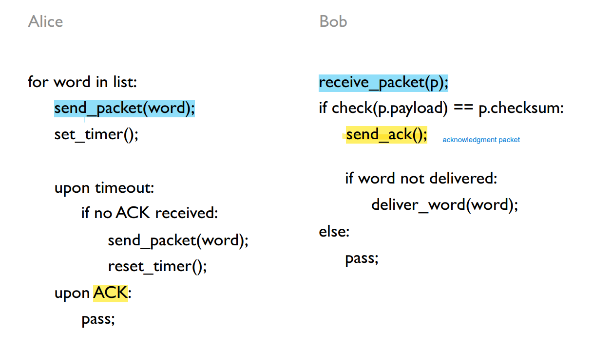
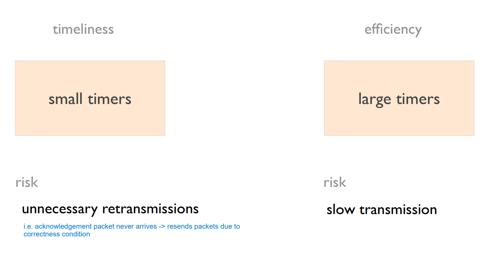
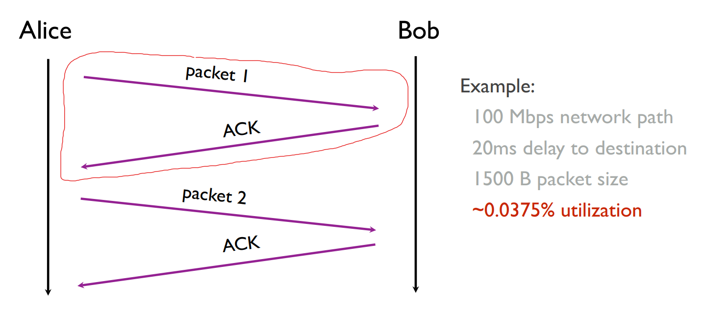
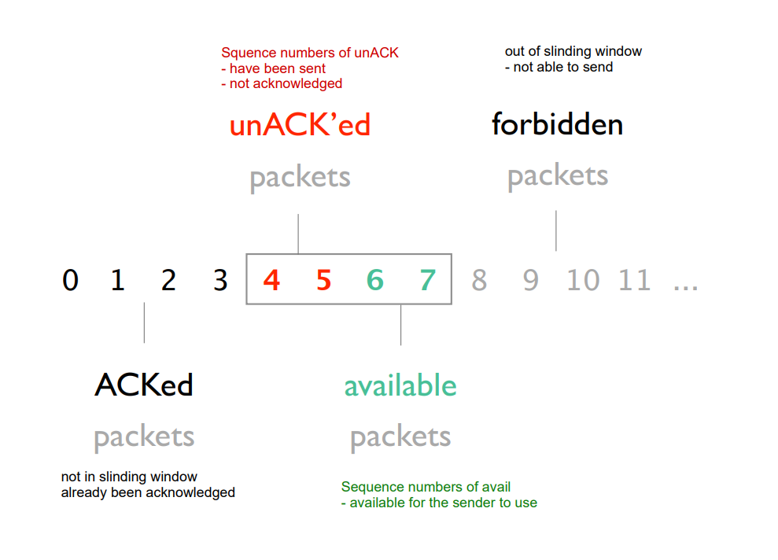
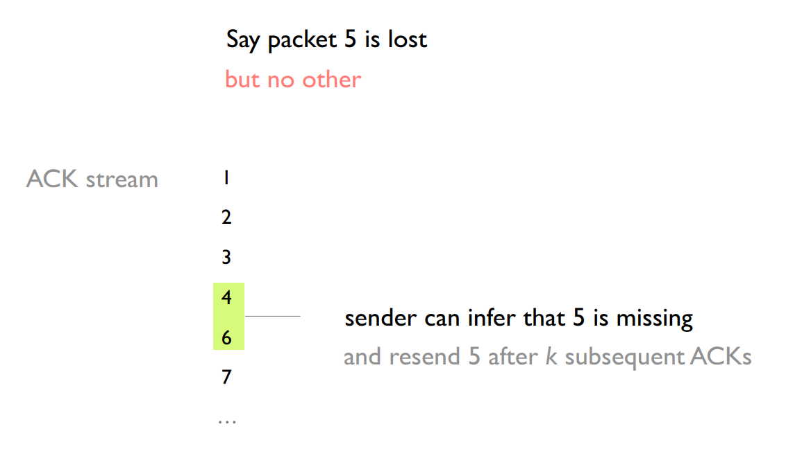
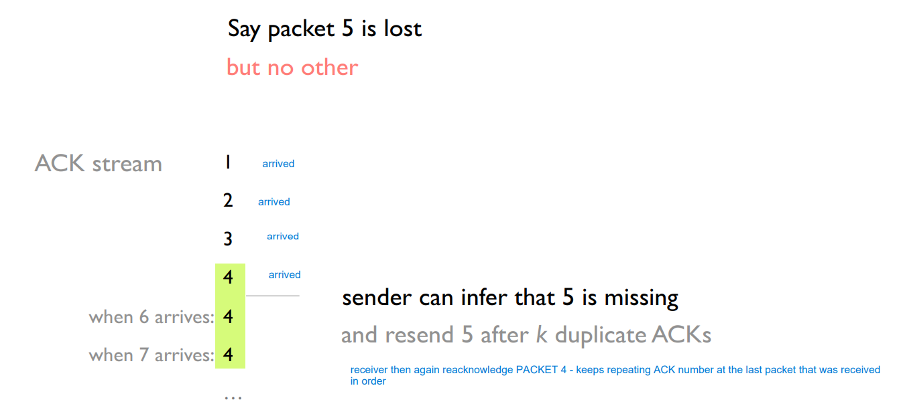
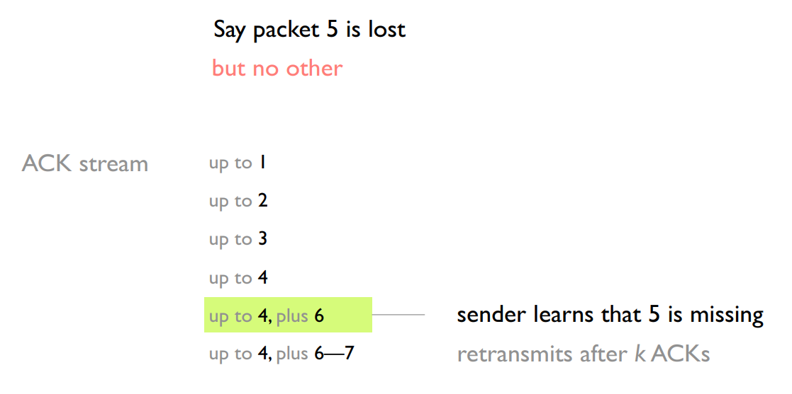
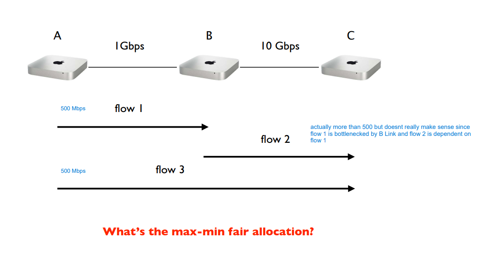
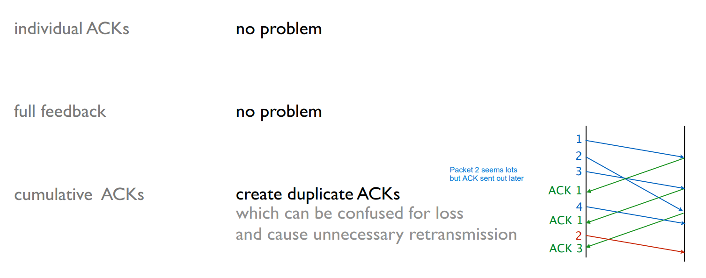
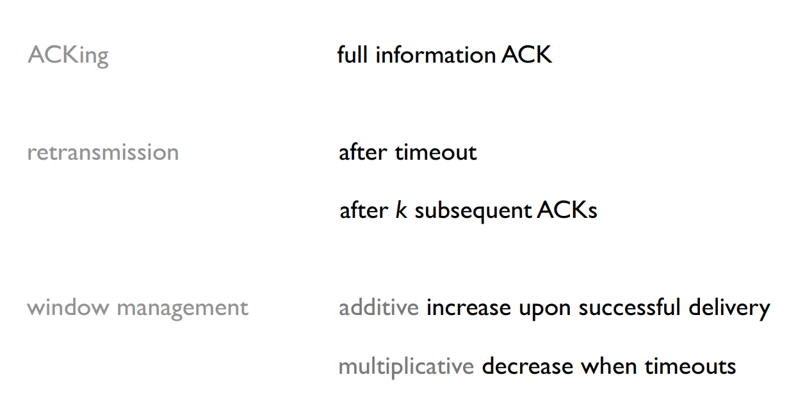

# Transport 

- [Transport](#transport)
  - [What should the transport layer provide?](#what-should-the-transport-layer-provide)
    - [The three layers](#the-three-layers)
  - [How do we build reliable transport?](#how-do-we-build-reliable-transport)
    - [The four goals of reliable transfer](#the-four-goals-of-reliable-transfer)
    - [Reliable Transport - Correctness Condition](#reliable-transport---correctness-condition)
    - [Reliable Transport - Design Space](#reliable-transport---design-space)
      - [Design Space - for Packet Loss](#design-space---for-packet-loss)
      - [Encoding/Decoding ACK's](#encodingdecoding-acks)
      - [What about Fairness?](#what-about-fairness)
      - [Design Space - corruption](#design-space---corruption)
      - [Design Space - reordering](#design-space---reordering)
      - [Design Space - delays](#design-space---delays)
      - [Design Space - duplicates](#design-space---duplicates)
    - [Reliable Transport - Examples](#reliable-transport---examples)
      - [Go-Back-N GBN](#go-back-n-gbn)
      - [Selective Repeat (SR)](#selective-repeat-sr)

## What should the transport layer provide?

### The three layers

**Application Layer**
- Keep minimal (easy to write)
- Restricted to app-specific functionality - enable easy growth and implementation for apps
- Want convenient way of using network - convenient way for app developers to use

**Transport Layer** :
- Tasked with providing interface for (reliable) transport over a potentially unreliable medium
- This relieves burden from both app and network i.e. no reliability implementation for Application and Network layer
- Key component of "host networking stack", i.e., networking code on host, shared by applications

**Network Layer** : 
- Keep minimal (easy to build, broadly applicable)
- Preoccupied with "getting from A to B" (`routing`)
- Global `best-effort` packet delivery - i.e. not too much performance or reliability

---

We'll take a closer look into the **Network Layer**. We can group the following issues into two groups :

**Systems/Programming Issues** - confined to the host 

- Data delivery to the correct application
  - IP just points towards next protocol
  - Transport needs to demultiplex incoming data (ports)
  
**Protocol/Algorithmic Issues** 

- Files or byte-streams abstractions for applications
  - reading from network source shouldnt be harder than reading from a file
  - Network deals with packets
  - Transport layer needs to translate between them

- Reliable transfer (if needed)

- Not overloading the receiver (`flow control`)
  - receiving can sometimes not process data fast enough
  
- Not overloading the network (`congestion control`)

## How do we build reliable transport?

Sending Packets / Messages through the internet isn't smooth sailing. The internet is an unreliable environment. Packets can get **lost**, **corrupted**, **reordered** or **duplicated**. 

### The four goals of reliable transfer

To build a reliable way to communicate we need to take these four goals into consideration : 
1. `correctness` : ensure data is delivered, in order, and untouched
2. `Timeliness` : Minimize time until data is transferred
3. `Efficiency` : Don't send too many (unnecessary) packets - use bandwidth optimally
4. `Fairness`: play well with concurrent communications

Let's take a look at a first example in pseudo code :

    

There are certain problems with this "implementation". 
1. The timer has to vary for different packet sizes.
2. Checking if ACK doesnt necessarily mean its the right ACK
3. receiver only checks if WORD is delivered or not, it could be that there are 2 packets with the same content.

### Reliable Transport - Correctness Condition

We want a crisp, formal translation of the correctness goal, namely : 

A packet **is always resent if** the previous packet was lost or corrupted. (A packet may be resent at other times). A reliable transport mechanism is correct **if and only if** it resends all dropped or corrupted packets

- Sufficient : algorithm will always keep trying to deliver undelivered packets
- Necessary : if it ever let a packet go undelivered without resending it, it isn’t reliable
- Note : it is ok to give up after a while but must announce it to the application

### Reliable Transport - Design Space

#### Design Space - for Packet Loss

We want to design a correct, timely, efficient and fair transport mechanism knowing that packets can get **lost** : 

There is a clear tradeoff between timeliness and efficiency in the selection of the timeout value. In the example earlier with Alice and Bob having small timers argues for Timeliness while large timers call for efficiency.

    

 
Even with short timers, our protocol is extremely slow and wasteful:  one packet per **Round-Trip Time** (RTT)

    

An obvious solution to improve timeliness is to send **multiple packets** at the same time. To achieve that we want to :
-  **add sequence number** inside each packet
-  **add buffers** to the sender and receiver
   -  sender : store packets sent & not acknowledged
   -  receiver : store out-of-sequence packets received
  
Sending multiple packets improves timeliness, but it can also overwhelm the receiver. i.e. that is when a sender sends 1000 packets/s while the receiver can only process 10packets/s.

To solve this issue, we need a mechanism for `flow control`

Using a `sliding window` is one way to do that :
- Sender keeps a list of the sequence numbers it can send known as the *sending window*
- Receiver also keeps a list of the acceptable sequence numbers known as the *receiving window*
- Sender and receiver negotiate the window size *sending window <= receiving window*
    why not = ? - processing capacity of the receiver may not be the most critical limit - rather the network capacity may constraint the sending rate

    

The sliding window slides one position to the right after receiving ACK 4.

**Timeliness** of the window protocol depends on the size of the sending window. Assuming infinite buffers, how big should the window be to maximize timeliness?

    The answer is : the same size as the data volume that fits into this network.
    That is the product of bandwith and delay between sender and receiver

The **efficiency** of our protocol depends on receiver feedback and how the sender uses it. 

- Zero feedback implies relying entirely on timers : *Very slow: Timer ≥ RTT* 
- ACKs are also feedback : *Receiver ACK-ed packets 1, 2, 3, and 5. Maybe 4 is lost with some probability?*

**Large timer: low timeliness, high efficiency**
**Short timer or pure ACK-based retransmission: high timeliness, low efficiency**

#### Encoding/Decoding ACK's

**Individual ACKs**

With individual ACKs, missing packets (gaps) are *implicit*

    

Individual ACKs provide detailed feedback, but trigger **unnecessary retransmission** on ACK losses. 

**Advantages**
- know the fate of each packet
- simple window algorithm : no decoding of ACK numbers required
- not sensitive to reordering

**Disadvantages**
- Loss of an ACK Packet causes unnecessary retransmission

Here's an example : packet 1 arrives - ACK packet lost 
then receiver sends ACK for Packet 2
-> No way to know for sender if Packet 1 was received 
-> unnecessary retransmission

---

**Cumulative ACKs**

Cumulative ACKs are more robust to ACK loss, but which packets are missing is harder to know. Cumulative ACKs keep repeating the ACK number from the last packet that was received in-order.

    

Duplicated ACKs are a sign of isolated losses. Dealing with them is trickier though.

Here's a situation :
- Lack of ACK progress means that 5 hasn’t made it
- Stream of ACKs means that (some) packets are delivered
- Sender could trigger resend situation upon receiving k duplicates ACK. 
    but what do you resend? only 5? 5 and everything after?

---

**Full Information ACKs**

Full information ACKs make missing packets (gaps) **explicit**

    

Full Information ACKs prevent unnecessary retransmissions, but incur a sizable *overhead*.

**Approach** : List all packets that have been received highest cumulative ACK, plus any additional packets

**Advantages** : complete information. It's the resilient form of individual ACKs

**Disadvantages** : overhead - lowering efficiency e.g., when large gaps between received packets

#### What about Fairness?

    When n entities are using our transport mechanism, we want a fair allocation of the available bandwidth

Note that fairness and efficiency don’t always play along. It is hard to define fairness formally as it can always seem different in others' eyes. But a universally agreed upon minimal goal is to avoid **starvation**. 

**Equal per flow** is good enough for this i.e. each flow in the network receives the same amount of "speed".

However simply dividing the available bandwidth doesn’t work in practice since flows can see different bottlenecks. Intuitively, we want to give users with "small" demands what they want, and evenly distribute the rest, for that we introduce the notion of Max-main fair.

**Max-min fair** allocation is such that :
- the lowest demand is maximized - *after the lowest demand is maximized*
- the second lowest demand is maximized - *after the second lowest demand has been satisfied,*
- the third lowest demand is maximized - *and so on*

Max-min fair allocation can easily be computed : 
1. Start with all flows at rate 0
2. Increase the flows simultaneously until there is a new bottleneck in the network aka the capacity of the bottleneck link is reached.
3. Hold the fixed rate of the flows that are bottlenecked
4. Go to step 2 for the remaining flows

    

Max-min fair allocation can be approximated by slowly increasing *W* = window size until a loss is detected.

1. Progressively increase the sending window size (max = receiving window)
2. Whenever a loss is detected, decrease the window size (signal of congestion)
3. repeat

#### Design Space - corruption

Dealing with corruption is easy: Rely on a `checksum`, treat corrupted packets as lost.

`checksum` is a function that:
- computes on the content of the packet and also
- is included in the packet

By comparing thoes values one can find out if a packet has been modified or not.

#### Design Space - reordering

The effect of reordering depends on the type of *ACKing mechanism* used

    

#### Design Space - delays
Long delays can create useless timeouts, **for all designs**

#### Design Space - duplicates
Packet duplicates can lead to duplicate ACKs whose effects will depend on the ACKing mechanism used.

individual ACKs : no problem
full feedback : no problem
cumulative ACK : problematic 

Let's visualize why it can be problematic for cumulative ACK

A 2nd ACK Packet of PACKET 2 will indicate that PACKET 3 has been lost. ACK Number sequence would look like the following : 

1
2
2

Let's say the receiver received Packet 3 and sent its ACK packet as well, it is unclear to the sender that Packet 3 has been received due to the duplication of PACKET 2. Thus the sender will try to resend Packet 3 after the timeout ends.

--- 

After Looking at all these problems we can set up one correct, timely, efficient and fair transport mechanism : More of this in TCP Lecture.

    

---

### Reliable Transport - Examples

We'll be taking a look at two sliding window implementations :

#### Go-Back-N GBN

`Go-Back-N (GBN)` is a simple sliding window protocol using cumulative ACKs

**Principle** :
- receiver should be as simple as possible

**Receiver** :
- delivers packets *in-order* to the upper layer for each received segment
- ACK the lasta in-order packet delivered (cumulative)
  
**Sender** : 
- use a *single timer* to detect loss, reset at each ACK
- upon timeout, resend all W packets starting with the lost one

Note that : When the sender concluded that some packet K was lost then all the PACKETS are resent upto PACKET K at the same time.

#### Selective Repeat (SR)

`Selective Repeat (SR)` avoid unnecessary retransmissions by using per-packet ACKs

**Principle** :
- avoids unnecessary retransmissions
  
**Receiver** : 
- acknowledge each packet, *in-order or not*
- buffer *out-of-order* packets

**Sender** : 
- use per-packet timer to detect loss
- upon loss, only resend the lost packet (NOT THE ACK like in GBN)

---

Here is a [link](http://www.ccs-labs.org/teaching/rn/animations/gbn_sr/) for a visualization of GBN and SR. 