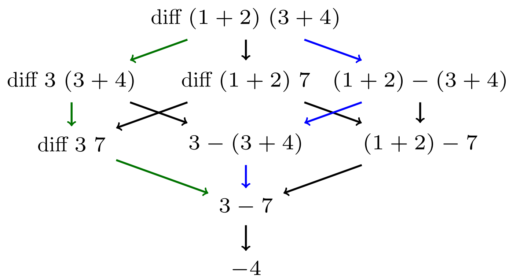
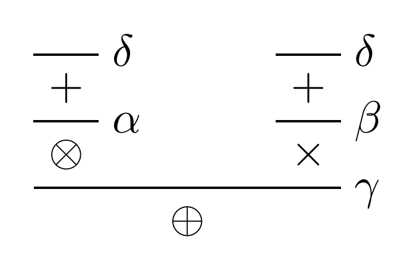
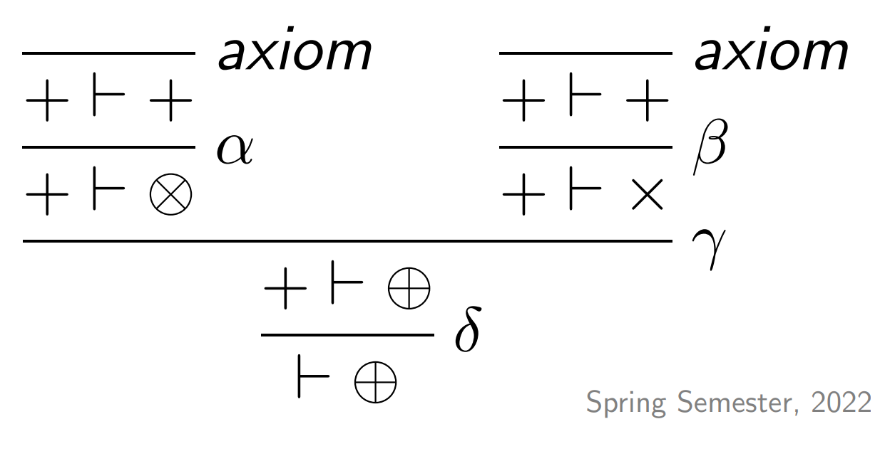

**Table of Contents of Lecture 1 and 2**
- [1. Introduction](#1-introduction)
  - [1.1. Basic Concepts in Functional Programming](#11-basic-concepts-in-functional-programming)
- [2. Introduction to functional Programming](#2-introduction-to-functional-programming)
  - [2.1. Expression Evaluations](#21-expression-evaluations)
  - [2.2. Syntax and Types](#22-syntax-and-types)
  - [2.3. 2D Layout](#23-2d-layout)
  - [2.4. Types](#24-types)
  - [2.5. Patterns and function Definition](#25-patterns-and-function-definition)
  - [2.6. Function Scope](#26-function-scope)
- [3. Natural Deduction](#3-natural-deduction)
  - [3.1. Formal Reasoning about systems](#31-formal-reasoning-about-systems)
  - [3.2. Propositional Logic](#32-propositional-logic)
    - [3.2.1. Syntax](#321-syntax)
    - [3.2.2. Semantics](#322-semantics)
    - [3.2.3. Requirements for deductive System](#323-requirements-for-deductive-system)
    - [3.2.4. Natural Deduction for propositional Formulae](#324-natural-deduction-for-propositional-formulae)
    - [3.2.5. Conjunction rules](#325-conjunction-rules)
    - [3.2.6. Implication rules](#326-implication-rules)
    - [3.2.7. Disjunction rules](#327-disjunction-rules)
    - [3.2.8. Falsity and Negation rules](#328-falsity-and-negation-rules)

# 1. Introduction
## 1.1. Basic Concepts in Functional Programming
Functions compute values but Functions can also be values. One basic concept in functional programming is that functions have no side effects. For example if $f(0) = 2$ then $f(0)+f(0) = 2+2 = 4$. This properity is called `referential transparency`.

Also recursion instead of iteration:
```haskell
    gcd x y
        | x == y    = x
        | x > y     = gcd (x-y) y
        | otherwise = gcd x     (y-x)
```
```java
    public static int gcd(int x , int y) {
        while (x != y) {
            if (x>y) x = x-y;
            else y = y -x;
        }
    }
```
# 2. Introduction to functional Programming
## 2.1. Expression Evaluations
There are two different types of evaluation strategies:
- `Eager Evaluation` : also called "call by value" - evaluate arguments first i.e. the _green_ path in the picture
- `Lazy Evaluation` : also called "call-by-need" - evaluate arguments only when needed (Haskell) i.e. the _blue_ path in the picture



## 2.2. Syntax and Types
`Functions and arguments start with lower-case letter`
- Function consists of different cases and look like this in general

```haskell
    functionName x1 ... xn
        | guard1 = expr1
        | ...
        | guardm = exprm
```
- Program consists of several definitions
```haskell
    myconstant = 5

    aFunction y1 ... ym
        | guard1 = expr1
        | guard2 = expr2

    anotherFunction z1 ... zk = ...
```
## 2.3. 2D Layout
Indentation determines seperation of definitions :
- All function definitions must start at same indentation level
- If a definition requires n > 1 lines, indent lines are 2 to n further
  
```haskell
    f1 x1 x2
        | a long guard which may go over over a 
        number of lines 
            = a long expression that also can go over some lines
            and looks like this
        | g2 = e2
    f2 x1 x2 x3 = ...
```
> Spaces are important. **Do not use TABs**

## 2.4. Types
**Integers** :
- Int $\in \{-2^{29}, ..., 2^{29}-1\}$ 
- Functions : $+, *, \^, -, \text{div}, \text{mod}, \text{abs}$ - `? mod 7 2` 
- An Infix binary function is alaso called an operator - `? 7 'mod' 2`
- Operators can be written in prefix notation - `? (+) 3 4`
- Operators have different binding strength : `^ binds stronger than +`
- Order and Equality return True or False of Type `Bool` i.e. >, >=, ==, /= ...

**Bool**
- Values: True or False
- Binary Operators `&&`, `||` and unary function `not` as usual

**Char** : 'a', 'b', ..., '0', '1', ..., '\t', '\n'
**String** : "hello", "123", "a"
**Double** : 0.3456, -2.85e03 = -2.85 * $10^3$ with functions like : +, -, *, abs, acos, asin, ceiling...

See here for more : [Documentation](https://hackage.haskell.org/package/base/docs/Prelude.html)

**Tuple**
Used to model composite objects ("records"). Tuples are represented in `()` brackets. Example : Student has name, ID number, starting year, where the first line is a constructor and the 2nd an element of that type.
```haskell
    Type         : (String,      Int,  Int)
    with element : ("Ueli Naef", 1234, 2016)
```
- Functions can take tuples as arguments or return tupled values
```haskell
    addPair :: (Int, Int) -> Int
    addPair (x,y) = x + y
    ? addPair(3,4) 
    7
```
- Patterns can be nested
```haskell
    shift :: ((Int, Int), Int) -> (Int, (Int, Int))
    shift ((x, y), z) = (x, (y, z))
```
- Pattern matching can be usesd to decompose tuples
```haskell
    name(s, id, y) = s
    studentNumber (s, id, y) = id
    year (s, id, y) = y
``` 
## 2.5. Patterns and function Definition

Functions definition are built from both patterns `mi` and guards `gi`
```haskell
    fun m1 m2 ... mn
        | g1          = e1
        ...
        | gm          = em
        | otherwise   = e  --optional!
```
- Patterns `mi` are variabales, constants or built from data constructors 
- Guards `gi` are Boolean expressions
- Pattern mataching forces evaluation i.e. if a boolean expression is true the evaluation according to that guard will be evaluated
```haskell
    silly b (x,y)                   Initialisation :
        | b         = x + y             pair = (4,2)
        | otherwise = x * y             silly (not True) pair
```

## 2.6. Function Scope
- Global Scope : a function can be called from any other
```haskell
    f x y = ..
    g x = ... h ...
    h z  = ... f ... g ...
```
- Local scope with `let`. `Let` builds one expression from others and is visibile to the function `e`.
```haskell
    let x1 = e1
        ...
        xn = en
    in e
```
- Local scope with `where`. `Where` comes directly after a function definition. The bindings are defined over all guards.
```haskell
    f p1 p2 ... pm
        | g1 = e1
        | g2 = e2
        :
        | gk = ek
        where
            v1 a1 ... an = r1
            v2 = r2
            :   
```
A function can be defines as follows :
```haskell
    yourFunction :: arg1 -> arg2 -> arg3 -> out
```

# 3. Natural Deduction
## 3.1. Formal Reasoning about systems
To formally reason about systesm we need three requirements
1. Language
2. Semantics
3. Deductive System for carrying out proofs

Here is an abstract example to start with this topic : 
- Language $\mathcal{L} = \{\bigoplus, \bigotimes, \times, +\}$
- Rules :  
  - $\alpha$ : If $+$, then $\bigotimes$
  - $\beta$ : If $+$, then $\times$
  - $\gamma$ : If $\bigotimes$ and $\times$, then $\bigoplus$
  - $\delta$ : $+$ holds

If we want to prove "$\bigoplus$" we can do it as follows 
1. $+$ holds by $\delta$
2. $\bigotimes$ holds by $\alpha$ with `1`
3. $\times$ holdsy by $\beta$ with `1`
4. $\bigoplus$ holds by $\gamma$ with `2` and `3`
   
In a deductive proof systems the rules are represented as follows :

$$
\frac{+}{\bigotimes} \alpha \hspace{0.75cm} \frac{+}{\times} \beta \hspace{0.75cm} \frac{\bigotimes \hspace{0.1cm} \times}{\bigotimes} \gamma \hspace{0.75cm} \frac{}{+} \delta
$$

The proof can be displayed as a Derivation Tree in Prawitz style:


By changing our system a little bit we get :
- Language: $\mathcal{L} = \{\bigoplus, \bigotimes, \times, + \}$
- Rules:
  - $\alpha$ : If $+$, then $\bigotimes$.
  - $\beta$ : If $+$, then $\times$.
  - $\gamma$ : If $\bigotimes$ and $\times$, then $\bigoplus$.
  - $\delta$ : **We may assume $+$ when proving $\bigotimes$.**

Our proof changes to:
1. **Assume** $+$ holds by $\delta$
2. $\bigotimes$ holds by $\alpha$ with `1`.
3. $\times$ holds by $\beta$ with `1`.
4. $\bigoplus$ holds by $\gamma$ with `2` and `3`.

The deductive proof systems looks as follows :

$$
\frac{\Gamma \vdash +}{\Gamma \vdash \bigotimes} \alpha \qquad \frac{\Gamma \vdash +}{\Gamma \vdash \times} \beta \qquad \frac{\Gamma \vdash \bigotimes \quad \Gamma \vdash \times}{\Gamma \vdash \bigoplus} \gamma \qquad \frac{\Gamma, + \vdash \bigoplus}{\Gamma \vdash \bigoplus} \delta \qquad \text{ and } \frac{}{\dots, A, \dots \vdash A} \text{axiom}
$$

The $\Gamma$ stands for some assumptions here in our case it would be assuming "+ holds by $\delta$"

The deriviation tree in Gentzen Style now :



## 3.2. Propositional Logic

### 3.2.1. Syntax
The definition is : 
- Let a set $\mathcal{V}$ of variables be given. Then $\mathcal{L}_P$, the `language of propositional logic`, is the smallest set where:
  - $X \in \mathcal{L}_P$ if $X \in \mathcal{V}$
  - $\bot \in \mathcal{L}_P$.
  - $A \land B \in \mathcal{L}_P$ if $A \in \mathcal{L}_P$ and $B \in \mathcal{L}_P$.
  - $A \lor B \in \mathcal{L}_P$ if $A \in \mathcal{L}_P$ and $B \in \mathcal{L}_P$.
  - $A \to B \in \mathcal{L}_P$ if $A \in \mathcal{L}_P$ and $B \in \mathcal{L}_P$.

### 3.2.2. Semantics
A `valuation` $\sigma : \mathcal{V} \to \{\text{True, False} \}$ is a function mapping variables to truth values. Let $Valuations$ be the set of valuations.

`Satisfiability` describes the smallest relation $\vDash \space \subseteq Valuations \times \mathcal{L}_P$ such that:
- $\sigma \vDash X$ if $\sigma(X) = \text{True}$
- $\sigma \vDash A \land B$ if $\sigma \vDash A$ and $\sigma \vDash B$
- $\sigma \vDash A \lor B$ if $\sigma \vDash A$ or $\sigma \vDash B$
- $\sigma \vDash A \to B$ if whenever $\sigma \vDash A$ then $\sigma \vDash B$
  
Note that $\sigma \nvDash \bot$, for every $\sigma \in Valuations$.

> A formula $A \in \mathcal{L}_P$ is `satisfiable` if 

$$
\sigma \vDash A \hspace{0.75cm} \text{ for some valuation } \sigma
$$

> A formula $A \in \mathcal{L}_P$ is `valid` (a `tautology`) if

$$
\sigma \vDash A \hspace{0.75cm} \text{ for all valuations } \sigma
$$

`Semantic entailment` : $A_1, \dots, A_n \vDash A$ if for all $\sigma$, if $\sigma \vdash A_1, \dots, \sigma \vDash A_n$, then $\sigma \vDash A$

Examples :
- $X \land Y$ is satisfiable as $\sigma \vDash X \land Y$ for $\sigma(X) = \sigma(Y) =$ TRUE
- $X \rightarrow X$ is valid

### 3.2.3. Requirements for deductive System
It is required that **syntactic entailment** $\vdash$ (derivation rules) and **semantic entailment** $\vDash$ (truth tables) should agree. This requirement has two parts :
1. `Soundness` : If $\Gamma \vdash A$ can be dervied then, $\Gamma \vDash A$
2. `Completeness` : If $\Gamma \vDash A$ then $\Gamma \vdash A$ can be derived

For some $\Gamma = A_1, \dots, A_n$

`Decidability` is also desirable. e.g. the complexity of determining whether a formula is satisifiable

### 3.2.4. Natural Deduction for propositional Formulae
A **sequent** is an assertion (judgement) of the form 

$$ A_1, \dots, A_n \vdash A$$

where all $A, A_1, \dots, A_n$ are propositional formulae. Intuitively : $A$ follows from the $A_i 's$ 

An **Axiom** is a starting point for building derivation trees

$$ \frac{}{\dots, A, \dots \vdash A} \text{axiom} $$

A **Proof** of $A$ is a derivation tree with root $\vdash A$.
> If a deductive system is sound, then $A$ is a tautology.

### 3.2.5. Conjunction rules
We have two rules : `introduction` and `elimination` connectives 

$$ \frac{\Gamma \vdash A \hspace{0.75cm} \Gamma \vdash B}{\Gamma \vdash A \land B} \, \land - I \qquad \frac{\Gamma \vdash A \land B}{\Gamma \vdash A}  \land - EL, \qquad \frac{\Gamma \vdash A \land B}{\Gamma \vdash B} \land - ER$$

Each rule is sound in that it preserves semantic entailment. E.g. for $\land -I$ 

$$
\text{if } \Gamma \vDash A \text{ and } \Gamma \vDash B \text{ then } \Gamma \vDash A \land B
$$

### 3.2.6. Implication rules
We have two rules

$$
\frac{\Gamma, A \vdash B}{\Gamma \vdash A \to B}   \to - I, \qquad \frac{\Gamma \vdash A \to B \hspace{0.75cm} \Gamma \vdash A}{\Gamma \vdash B}  \to - E
$$

### 3.2.7. Disjunction rules
We have three rules for Disjunction

$$
\frac{\Gamma \vdash A}{\Gamma \vdash A \lor B}  \lor - IL \qquad \frac{\Gamma \vdash B}{\Gamma \vdash A \lor B}  \lor - IR
$$

$$
\frac{\Gamma \vdash A \lor B \hspace{0.75cm} \Gamma, A \vdash C \hspace{0.75cm} \Gamma, B \vdash C}{\Gamma \vdash C}  \lor - E
$$

### 3.2.8. Falsity and Negation rules
One rule for Falsity and one for Negation

$$ 
\frac{\Gamma \vdash \bot}{\Gamma \vdash A} \bot - E \hspace{0.75cm} \frac{\Gamma \vdash \neg A \hspace{0.75cm} \Gamma \vdash A}{\Gamma \vdash B} \neg - E
$$

_Peirce's Law_ : $ ((A \rightarrow B) \rightarrow A) \rightarrow A$. This formula is valid however it is not provable. 